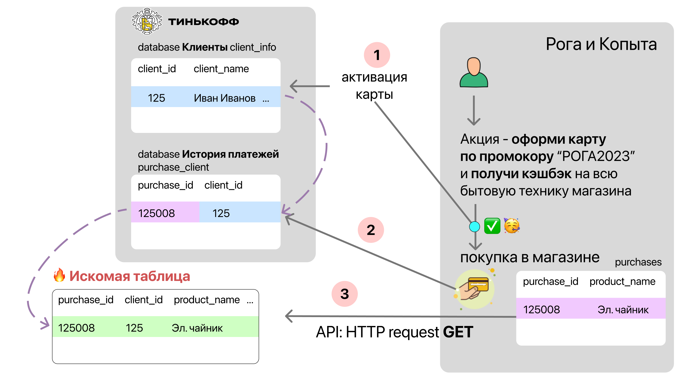
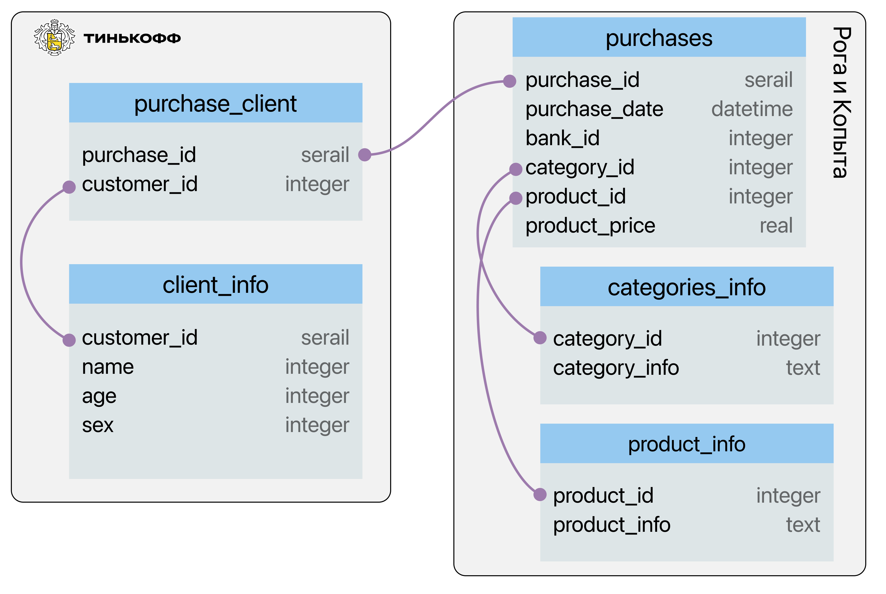

# Кейс для системных аналитиков

## Анализ задания

Согласно заданию, предполанается, что ритейлер будет ежедневно предоставлять следующие данные

- ФИО
- Номер телефона
- Email
- Список покупок в рамках акции с ценой товаров

Мне кажется, что ритейлеру будет довольно сложно (или невозможно) предосавить первые три вида данных, т.к. связать личные данные попупателя с совершенное покупкой:

- зачастую невозможно (например, у магазина нет карты специальной карты лояльности или покупатель ее не преобрел / предоставил при оплате)
- к карте лояльности зачастую привязана неактуальная (или фейковая) информация

Скорее всего со стороны ритейлера следует запросить только информацию о покупках за день, которую можно будет связать с личными данными хранящимися в банке.

### Пример

Например, Банк проводит акцию с ритейлером "Рога и Копыта" в формате: "оформи карту по **промокору** “РОГА2023”и _получи кэшбэк_ на всю бытовую технику магазина в течении N месяцев" (_см. рисунок ниже_).

1. После оформления карты на сайте, данные попадают в базу данных о клиентах (`client_id, client_name, ...`)
2. При оплате, магазин посылает запрос в банк для подтверждения операции. Эти данные можно использовать чтобы связать покупку и клиента (`purchase_id <---> client_id`).
3. Соответственно, от магазина нам нужно запросить только `purchase_id` с привязанными к нему данными о покупке (товар, категория, цена и пр.). Этот запрос я описал ниже в разделе [API doc (openapi)](#api-doc-openapi)



## API doc (openapi)

Предположим, что от ритейлера мы можем получить следующие данные

- `purchase_id` - id покупки,
- `purchase_date` - время, когда покупка была совершена,
- `bank_id` id банка (1 - Тинькофф, 2 - Сбер и т.д.),
- `category_id` - катерогия продукта,
- `product_id` - id продукта,
- `product_price` цена за одну единицу,

Получить эти данные можно по следующему url:

```
https://api.roga-and-kopita.com/get_purchases?date=2023-03-21&bank_name=tinkoff&auth_key=1d43f345bv65f45
```

где

- `date` - дата (день, за который необходимо получить данные)
- `bank_name` - имя банка
- `auth_key` - токен, позволяющий осуществить запрос

Опишем модель API для получения списка покупок используя openapi:

```yaml
openapi: 3.0.2
info:
  title: Рога и Копыта API
  description: >
    part of API of
    marketplace "Рога и Копыта"
  version: "0.21.1"

servers:
  - url: https://api.roga-and-kopita.com
    description: API server

paths:
  /get_purchases:
    get:
      description: get array of purchases
      security:
        - ApiKeyAuth: []
      parameters:
        - in: query
          name: date
          schema:
            type: string
            example: "2023-03-21"
        - in: query
          name: bank_name
          schema:
            type: string
            example: "tinkoff"
      responses:
        "200":
          description: array of purchases returned
          content:
            application/json:
              schema:
                type: object
                properties:
                  response:
                    type: array
                    items:
                      $ref: "#/components/schemas/Purchase"
        "401":
          description: Not authenticated
        "403":
          description: Access token does not have the required scope

# create component (allows reuse)

components:
  schemas:
    Purchase:
      properties:
        purchase_id:
          type: integer
          example: 12500075
        date:
          type: string
          example: "2023-03-21 10:00:00.000"
        category_id:
          type: integer
          example: 45
        product_id:
          type: integer
          example: 78
        product_price:
          type: number
          example: 1205.20

  securitySchemes:
    ApiKeyAuth:
      type: apiKey
      in: query
      name: auth_key
```

Также ритейлер должен предоставить отдельную таблицу с описанием категорий и id продуктов (`category_id` и `product_id`).

## Хранение в базе данных

База данных может иметь следующую структуру:

- `client_info` (информация о клиенте) и `purchase_client` ("история" операций) всзяты из внутренних баз данных Банка.
- `purchases`, `categories_info` и `product_info` получены от ритейлера

Основная таблица в схеме - `purchases`. Искомая таблица может быть получена с помощью join запросов.



## API test

Я написал небольшой сервер (на FastAPI)

```sh
# клонируем репозиторий
git clone

# создаем и активируем виртуальное окружение
python3.11 -m venv .env
source .env/bin/activate

# скачиваем зависитости


# запускаем сервер
```
